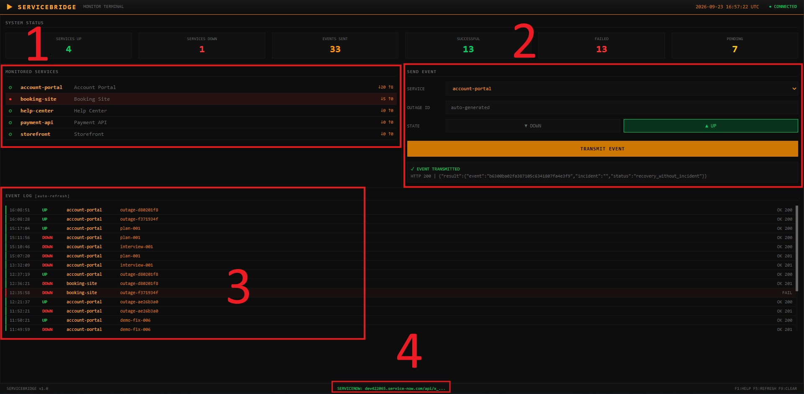

# ServiceBridge

A local monitor reports a website DOWN or UP. ServiceNow receives that report on a Scripted REST API, stores a Monitor Event, and opens or updates a native Incident. An UP event records recovery and leaves the Incident open.



1. **Monitored services.** The sites this dashboard watches, and whether the last local reading was up or down. This list is on your machine. It is not the Incident.
2. **Send event.** Choose the service, type an outage id, pick DOWN or UP, then transmit. The line under the button is the HTTP status ServiceNow returned.
3. **Event log.** Each send from this page: time, DOWN or UP, service, outage id, and OK or FAIL with the status code.
4. **ServiceNow footer.** The instance this dashboard is configured to call. **CONNECTED** means the URL and user are set. A successful transmit is the proof the call worked.

## Demo

[](https://youtu.be/UHHJGj-Bgto)

**Demo:** https://youtu.be/UHHJGj-Bgto

## Run the dashboard

Requires [uv](https://docs.astral.sh/uv/).

```powershell
cd servicebridge
uv sync
$env:SERVICEBRIDGE_NOW_URL = "https://YOUR_INSTANCE.service-now.com/api/YOUR_SCOPE/servicebridge/monitor/events"
$env:SERVICEBRIDGE_NOW_USER = "servicebridge.integration"
$env:SERVICEBRIDGE_NOW_PASSWORD = "YOUR_PASSWORD"
uv run python -m servicebridge_ui.app
```

Open **http://127.0.0.1:8080**.

The variable names are listed in `.env.example`. Keep the real instance URL and password in `LOCAL.md` on your machine. That file is gitignored. Do not commit it, and do not paste the password into this README.

Run the command from this directory, not from `servicebridge_ui/`.

## What is in this repository

```
servicebridge/
├── docs/DEMO_GUIDE.md          # Shot list for the demo video
├── docs/UI_GUIDE.md            # Dashboard layout
├── servicebridge_ui/           # Local dashboard
└── servicenow/
    ├── scripted_rest/post_monitor_event.js
    └── script_includes/BridgeEventProcessor.js
```

The dashboard sends JSON. It does not insert the Incident itself. `post_monitor_event.js` checks the integration role and calls `BridgeEventProcessor`. That class writes the platform Incident table. Table names in those scripts use the scoped app prefix from the developer instance.

The `servicenow/` files are the scripts installed on the instance. This repository is not an importable ServiceNow application.

## License

MIT. ServiceNow platform software is not included.
